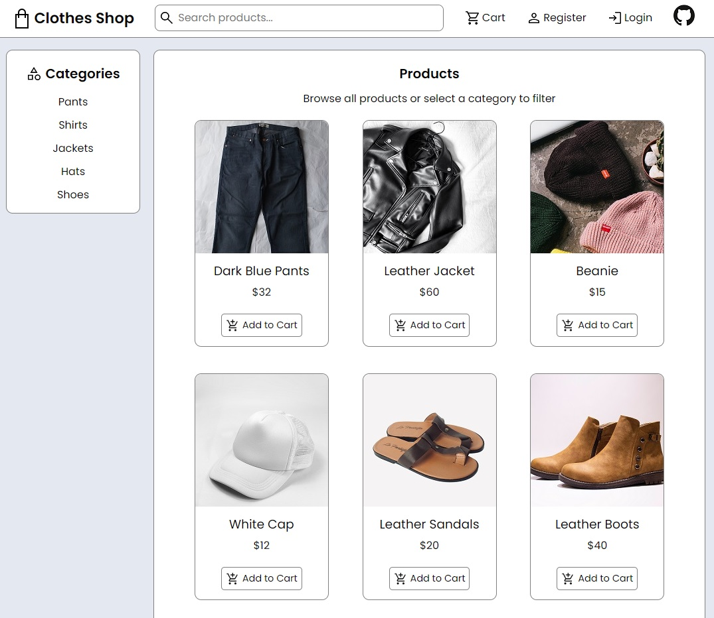
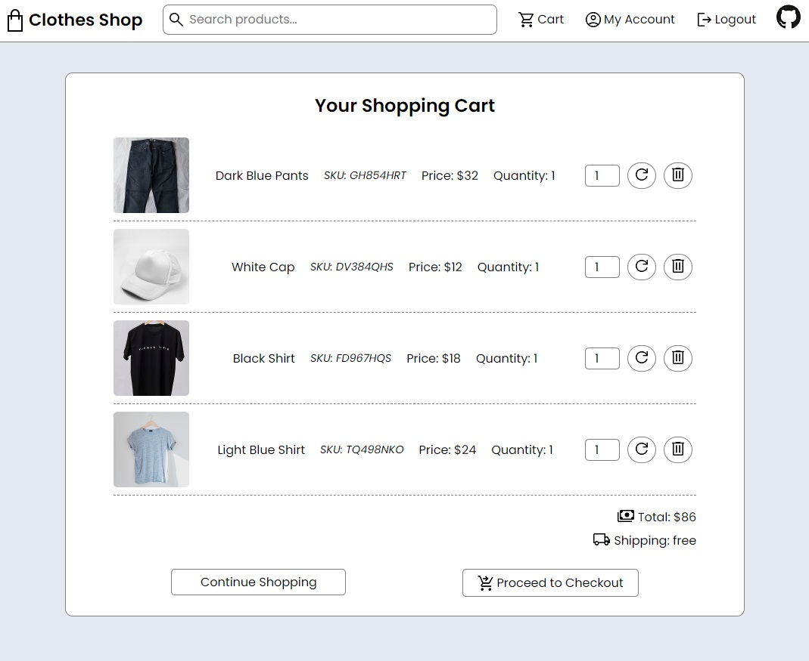
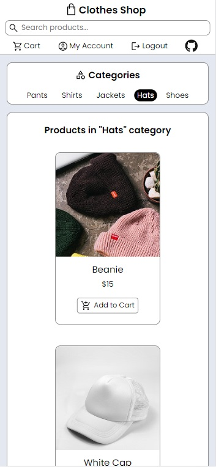
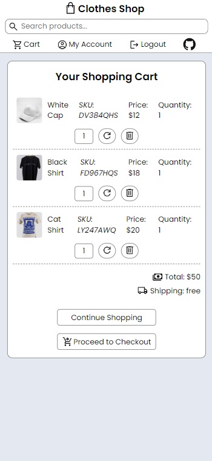

# E-commerce Client

This project is a follow-up on the [E-commerce RESTful API](https://github.com/Pedro-Freddi/ecommerce-api) project, with the goal of designing a user interface that communicates with the API. The result is a client-side rendered clothing e-commerce website named "Clothes Store" (very creative).

The project's plan can be found in the [docs folder](./docs).

## Technologies

* React v18.2.0
* Redux Toolkit v1.8.3
* React Router v6.3.0
* CSS Modules

## Features

* Categories and products browsing.
* Search feature to find products by name.
* Account registration and login/logout.
* Account area to manage information and orders.
* Shopping cart with add/update/delete features.
* Cart checkout and order creation.
* Simple UI with flat design and soft colors.
* Responsive layout that adapts to all screen sizes.

## Screenshots

Desktop <br>




Mobile <br>




More screenshots of [desktop](./docs/screenshots/desktop) and [mobile](./docs/screenshots/mobile) views are available.

## Running the Application Locally

Make sure to set up the [ecommerce-api](https://github.com/Pedro-Freddi/ecommerce-api) application before installing and running this client so that it can fetch data from the back-end.

1. Clone this repository:
```
git clone https://github.com/Pedro-Freddi/ecommerce-client.git
cd ecommerce-client
```

2. Install dependencies:
```
npm install
```

3. Add missing environments variables or adjust their values if you like in `/EXAMPLE.env` and rename the file to `.env`.

4. On a different terminal instance, navigate to the `ecommerce-api` application's root directory and run it:
```
npm start
```

5. Now run the client on the previous terminal:
```
npm start
```

6. Navigate to `http://localhost:3000` on your browser to access the client. The back-end should be running at `http://localhost:8000`.

## Acknowledgements

* Icons from [freeicons.io](https://freeicons.io/) and [Google Material Symbols](https://fonts.google.com/icons).
* Loading animations from the [React Spinners](https://www.davidhu.io/react-spinners/) library.
* Products pictures from [Unsplash](https://unsplash.com/).
